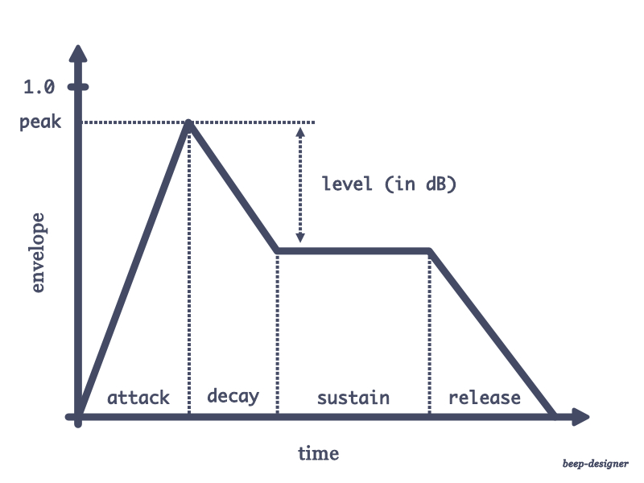

# beep-designer

Because you deserve the perfect beep.

Design a beep based on this model:


A level of -6 corresponds to an sustain amplitude that is about half the peak.

## Run from the shell

Replace any variable in the model above on the command line.

```shell
python3 create-beep.py --frequency 440 --peak 0.5 --sustain 0.1 --output beep.wav
```

All parameters have defaults, so this also works:

```shell
python3 create-beep.py
```

See the end of `create-beep.py` for defaults.