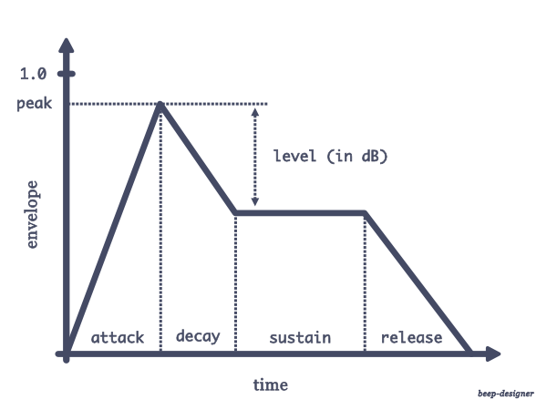

# beep-designer

Because you deserve the perfect beep.

```shell
python3 create-beep.py --frequency 440 --sustain 0.1 --output beep.wav
```

## Parameters

Design a beep based on this model:


Replace any variable name above in the command line tool.

See the end of `create-beep.py` for defaults and units.